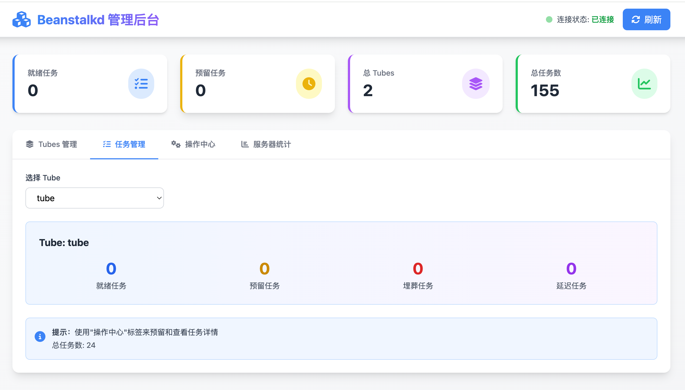

# Beanstalkd CLI

[🇨🇳 中文版](README.md) | [🇺🇸 English](README-EN.md)

一个功能最齐全的 Beanstalkd 工具套件，包含强大的命令行工具和现代化的 Web 管理界面。

## ✨ 项目特色

🎯 **功能最全** - 支持所有 Beanstalkd 协议命令  
🎨 **两种界面** - 命令行工具 + Web 管理后台  
🧪 **完整测试** - 31个测试用例，100%通过  
📚 **文档齐全** - 中英文文档，使用示例丰富  
🚀 **开箱即用** - 编译即用，无需配置  

## 🎁 功能特性

### 命令行工具
- ✅ 完整支持所有 Beanstalkd 命令（26个命令）
- ✅ 彩色输出和表格显示
- ✅ 灵活的命令行参数
- ✅ 支持多个 tube 操作
- ✅ 详细的统计信息
- ✅ 中文友好提示

### Web 管理后台
- 🎨 现代化 UI 设计（Tailwind CSS）
- 📊 实时监控面板，自动刷新
- 🔄 完整的任务管理功能
- 📱 响应式设计，支持移动端
- ⚙️ 灵活配置（命令行/环境变量）
- 🌐 RESTful API 接口

### 测试套件
- ✅ 完整的测试覆盖（31个测试用例）
- ✅ 连接、任务、Tube、统计等全方位测试
- ✅ 集成测试和性能基准测试
- ✅ 100% 测试通过

## 📦 快速开始

### 安装

```bash
# 克隆项目
git clone <repository-url>
cd beanstalkd-cli

# 下载依赖
go mod tidy

# 编译命令行工具
go build -o beanstalkd-cli

# 或者直接运行
go run main.go
```

### 启动 Web UI

```bash
cd web
./start.sh
```

访问: **http://localhost:8080**

### 运行测试

```bash
# 运行所有测试
make test

# 查看测试覆盖率
make coverage
```

## 使用说明

### 基本命令

```bash
# 查看帮助
./beanstalkd-cli --help

# 指定服务器地址和端口（默认: 127.0.0.1:11300）
./beanstalkd-cli -H 127.0.0.1 -p 11300 <command>

# 指定 tube（默认: default）
./beanstalkd-cli -t mytube <command>
```

### 任务管理

#### 插入任务 (Put)
```bash
# 插入一个任务到 default tube
./beanstalkd-cli put "hello world"

# 指定优先级、延迟和 TTR
./beanstalkd-cli put "task data" -r 100 -d 5s -T 60s

# 插入到指定 tube
./beanstalkd-cli -t mytube put "task data"
```

#### 预留任务 (Reserve)
```bash
# 预留一个任务
./beanstalkd-cli reserve

# 指定超时时间
./beanstalkd-cli reserve -T 10s

# 从指定 tube 预留
./beanstalkd-cli -t mytube reserve
```

#### 删除任务 (Delete)
```bash
./beanstalkd-cli delete 123
```

#### 释放任务 (Release)
```bash
# 释放任务回队列
./beanstalkd-cli release 123

# 指定新的优先级和延迟
./beanstalkd-cli release 123 -r 200 -d 10s
```

#### 埋葬任务 (Bury)
```bash
./beanstalkd-cli bury 123 -r 1024
```

#### 踢出任务 (Kick)
```bash
# 踢出最多 10 个被埋葬或延迟的任务
./beanstalkd-cli kick 10

# 踢出指定 ID 的任务
./beanstalkd-cli kick-job 123
```

#### 触摸任务 (Touch)
```bash
# 请求更多时间处理已预留的任务
./beanstalkd-cli touch 123
```

### 查看任务

#### 查看任务 (Peek)
```bash
# 查看指定 ID 的任务
./beanstalkd-cli peek 123

# 查看下一个就绪任务
./beanstalkd-cli peek-ready

# 查看下一个延迟任务
./beanstalkd-cli peek-delayed

# 查看下一个被埋葬的任务
./beanstalkd-cli peek-buried
```

### Tube 管理

```bash
# 列出所有 tubes
./beanstalkd-cli list-tubes

# 查看当前使用的 tube
./beanstalkd-cli list-tube-used

# 查看正在监视的 tubes
./beanstalkd-cli list-tubes-watched

# 使用指定 tube（用于 put 操作）
./beanstalkd-cli use mytube

# 监视 tube（用于 reserve 操作）
./beanstalkd-cli watch mytube

# 停止监视 tube
./beanstalkd-cli ignore mytube
```

### 统计信息

```bash
# 服务器统计
./beanstalkd-cli stats

# 任务统计
./beanstalkd-cli stats-job 123

# Tube 统计
./beanstalkd-cli stats-tube default
```

## 示例工作流

### 1. 生产者示例
```bash
# 插入多个任务到 default tube
./beanstalkd-cli put "task 1"
./beanstalkd-cli put "task 2" -r 100
./beanstalkd-cli put "task 3" -d 5s

# 查看 tube 统计
./beanstalkd-cli stats-tube default
```

### 2. 消费者示例
```bash
# 监视 tube
./beanstalkd-cli watch default

# 预留并处理任务
./beanstalkd-cli reserve
# 处理任务...
# 完成后删除
./beanstalkd-cli delete <job-id>

# 或者释放回队列
./beanstalkd-cli release <job-id>
```

### 3. 管理示例
```bash
# 查看所有 tubes
./beanstalkd-cli list-tubes

# 查看服务器状态
./beanstalkd-cli stats

# 查看特定 tube 的统计
./beanstalkd-cli stats-tube mytube

# 踢出被埋葬的任务
./beanstalkd-cli -t mytube kick 100
```

## 命令参考

### 全局选项
- `-H, --host`: Beanstalkd 服务器地址（默认: 127.0.0.1）
- `-p, --port`: Beanstalkd 服务器端口（默认: 11300）
- `-t, --tube`: Tube 名称（默认: default）

### 任务命令
- `put [data]`: 插入任务
  - `-r, --priority`: 优先级（默认: 1024，0 是最高）
  - `-d, --delay`: 延迟时间（如: 5s, 1m）
  - `-T, --ttr`: 处理时间限制（默认: 60s）

- `reserve`: 预留任务
  - `-T, --timeout`: 超时时间（0 为阻塞）

- `delete [job-id]`: 删除任务
- `release [job-id]`: 释放任务
  - `-r, --priority`: 新优先级
  - `-d, --delay`: 延迟时间

- `bury [job-id]`: 埋葬任务
  - `-r, --priority`: 新优先级

- `kick [bound]`: 踢出任务
- `kick-job [job-id]`: 踢出指定任务
- `touch [job-id]`: 触摸任务

### 查看命令
- `peek [job-id]`: 查看任务
- `peek-ready`: 查看下一个就绪任务
- `peek-delayed`: 查看下一个延迟任务
- `peek-buried`: 查看下一个被埋葬的任务

### Tube 命令
- `list-tubes`: 列出所有 tubes
- `list-tube-used`: 查看当前使用的 tube
- `list-tubes-watched`: 查看正在监视的 tubes
- `use [tube-name]`: 使用 tube
- `watch [tube-name]`: 监视 tube
- `ignore [tube-name]`: 停止监视 tube

### 统计命令
- `stats`: 服务器统计
- `stats-job [job-id]`: 任务统计
- `stats-tube [tube-name]`: Tube 统计

## 🌐 Web UI 管理后台

项目提供了一个功能完整、界面现代化的 Web 管理后台！

### ✨ 界面特性

- 🎨 **现代化设计** - Tailwind CSS，渐变色，流畅动画
- 📊 **实时监控** - 4个关键指标卡片，每10秒自动刷新
- 🎯 **完整功能** - Tubes管理、任务管理、操作中心、服务器统计
- 📱 **响应式设计** - 完美支持桌面端和移动端
- 🔔 **操作反馈** - Toast 通知，操作状态清晰可见
- ⚙️ **灵活配置** - 支持命令行参数和环境变量

### 🚀 快速启动

#### 使用默认配置
```bash
cd web
./start.sh
# 或
go run server.go
```

#### 自定义配置
```bash
# 方式1: 命令行参数
go run server.go -beanstalkd 192.168.1.100:11300 -port 9090

# 方式2: 环境变量
export BEANSTALKD_HOST=192.168.1.100:11300
export WEB_PORT=9090
go run server.go

# 方式3: 启动脚本传参
./start.sh -beanstalkd 192.168.1.100:11300 -port 9090
```

### 📋 功能模块

#### 1. 实时监控面板
- 就绪任务数、预留任务数、Tubes总数、总任务数
- 自动刷新，连接状态实时显示

#### 2. Tubes 管理
- 卡片式展示所有 Tubes
- 每个 Tube 显示详细统计（就绪、预留、埋葬、延迟）
- 快速查看详情

#### 3. 任务管理
- 选择 Tube 查看任务统计
- 任务状态分布
- 快速操作入口

#### 4. 操作中心
- **插入任务** - 支持优先级和延迟设置
- **预留任务** - 超时控制，显示任务数据
- **删除任务** - 安全确认机制
- **踢出任务** - 批量处理

#### 5. 服务器统计
- 完整的服务器统计信息
- 美观的卡片式展示

### 🔧 配置说明

Web UI 支持灵活配置：

| 配置项 | 命令行参数 | 环境变量 | 默认值 |
|--------|-----------|---------|--------|
| Beanstalkd 地址 | `-beanstalkd` | `BEANSTALKD_HOST` | `127.0.0.1:11300` |
| Web 端口 | `-port` | `WEB_PORT` | `8080` |

**配置优先级**: 命令行参数 > 环境变量 > 默认值

### 📚 详细文档

- **英文文档**: [web/README.md](web/README.md)
- **使用说明**: [web/使用说明.md](web/使用说明.md)
- **配置说明**: [web/配置说明.md](web/配置说明.md)

### 🎯 适用场景

- 开发调试 - 快速查看和操作任务
- 运维监控 - 实时监控队列状态
- 问题排查 - 查看任务详情和统计
- 团队协作 - 可视化的队列管理
- 演示展示 - 美观的界面展示

### 🖼️ 界面预览

<p align="center">
  
  <br><em>仪表盘首页：实时统计与全局概览</em>
</p>

<p align="center">
  
  <br><em>Tube 管理：各 Tube 详情与状态一目了然</em>
</p>

<p align="center">
  
  <br><em>操作中心：插入、预留、删除、踢出任务集中管理</em>
</p>

## 🧪 测试套件

项目包含完整的测试套件，覆盖所有核心功能。

### 测试统计

- **测试文件**: 7 个
- **测试用例**: 31 个
- **通过率**: 100% ✅
- **功能覆盖**: 100%

### 测试类型

- **连接测试** - 基本连接、超时、失败处理、并发连接
- **任务操作测试** - Put、Reserve、Delete、Release、Bury、Touch、Kick
- **查看操作测试** - Peek 系列命令
- **Tube 操作测试** - Tubes 管理、隔离性、并发访问
- **统计测试** - 服务器、任务、Tube 统计
- **集成测试** - 完整流程、重试机制、优先级队列
- **性能测试** - 基准测试

### 运行测试

```bash
# 运行所有测试
make test

# 详细测试输出
make test-verbose

# 性能基准测试
make bench

# 测试覆盖率
make coverage
```

详细文档: [tests/测试说明.md](tests/测试说明.md)

## 📁 项目结构

```
beanstalkd-cli/
├── cmd/                    # CLI 命令实现
│   ├── root.go            # 根命令和连接管理
│   ├── put.go             # 插入任务
│   ├── reserve.go         # 预留任务
│   ├── delete.go          # 删除任务
│   ├── release.go         # 释放任务
│   ├── bury.go            # 埋葬任务
│   ├── kick.go            # 踢出任务
│   ├── touch.go           # 触摸任务
│   ├── peek.go            # 查看任务
│   ├── stats.go           # 统计信息
│   └── tubes.go           # Tube 管理
├── web/                    # Web UI 管理后台
│   ├── index.html         # 主页面
│   ├── app.js             # 前端逻辑
│   ├── server.go          # Go 后端服务器
│   ├── start.sh           # 启动脚本
│   └── *.md               # 文档
├── tests/                  # 测试套件
│   ├── *_test.go          # 测试文件
│   ├── test_helper.go     # 测试辅助函数
│   └── *.md               # 测试文档
├── main.go                 # CLI 主程序入口
├── go.mod                  # Go 模块配置
├── Makefile               # 便捷命令
├── README.md              # 项目文档（本文件）
├── QUICK_START.md         # 快速开始
├── 使用指南.md            # 中文详细指南
└── 项目说明.md            # 项目概述
```

## 📚 文档目录

### 中文文档
- [快速开始](QUICK_START.md) - 5分钟快速上手
- [使用指南](使用指南.md) - 详细的使用说明和示例
- [项目说明](项目说明.md) - 项目功能和特色介绍
- [Web UI 使用说明](web/使用说明.md) - Web 管理后台使用指南
- [Web UI 配置说明](web/配置说明.md) - Web UI 配置详解
- [测试说明](tests/测试说明.md) - 测试套件说明

### 英文文档
- [README.md](README.md) - 项目主文档（本文件）
- [Web UI README](web/README.md) - Web 管理后台文档
- [Tests README](tests/README.md) - 测试套件文档

## 🎯 使用场景

### 开发调试
- 使用 CLI 工具快速操作队列
- 使用 Web UI 可视化查看任务状态
- 运行测试验证功能

### 生产运维
- 监控队列状态和任务数量
- 管理被埋葬的任务
- 查看详细的统计信息
- 快速排查问题

### 团队协作
- Web UI 提供统一的管理界面
- 操作记录清晰可见
- 支持多环境配置

## 🚀 部署建议

### 开发环境
```bash
# CLI 工具
./beanstalkd-cli --help

# Web UI（默认配置）
cd web && ./start.sh
```

### 测试环境
```bash
# CLI 工具连接测试服务器
./beanstalkd-cli -H test-server -p 11300 stats

# Web UI 使用环境变量
export BEANSTALKD_HOST=test-server:11300
cd web && ./start.sh
```

### 生产环境
```bash
# CLI 工具
./beanstalkd-cli -H prod-server -p 11300 <command>

# Web UI 使用命令行参数
cd web
go run server.go -beanstalkd prod-server:11300 -port 80
```

### Docker 部署
```dockerfile
FROM golang:1.24-alpine
WORKDIR /app
COPY . .
RUN go build -o beanstalkd-cli

# CLI 工具
ENTRYPOINT ["./beanstalkd-cli"]

# 或启动 Web UI
# WORKDIR /app/web
# ENV BEANSTALKD_HOST=beanstalkd:11300
# CMD ["go", "run", "server.go"]
```

## 🛠️ 技术栈

### 命令行工具
- **Go 1.24.4** - 编程语言
- **Cobra** - CLI 框架
- **go-beanstalk** - Beanstalkd 客户端库
- **tablewriter** - 表格输出
- **color** - 彩色输出

### Web 管理后台
- **Go** - 后端服务器
- **HTML5** - 页面结构
- **Tailwind CSS** - 样式框架（CDN）
- **Font Awesome** - 图标库（CDN）
- **原生 JavaScript** - 前端交互

### 测试框架
- **Go testing** - 测试框架
- **go-beanstalk** - 客户端库

## 🔗 相关资源

- [Beanstalkd 官方文档](https://beanstalkd.github.io/)
- [Beanstalkd 协议](https://github.com/beanstalkd/beanstalkd/blob/master/doc/protocol.txt)
- [go-beanstalk 库](https://github.com/beanstalkd/go-beanstalk)

## 🤝 贡献

欢迎提交 Issue 和 Pull Request！

## 📄 许可证

MIT License

---

**开箱即用的 Beanstalkd 完整工具套件！** 🎉
